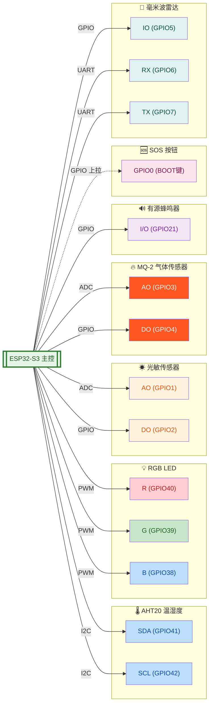
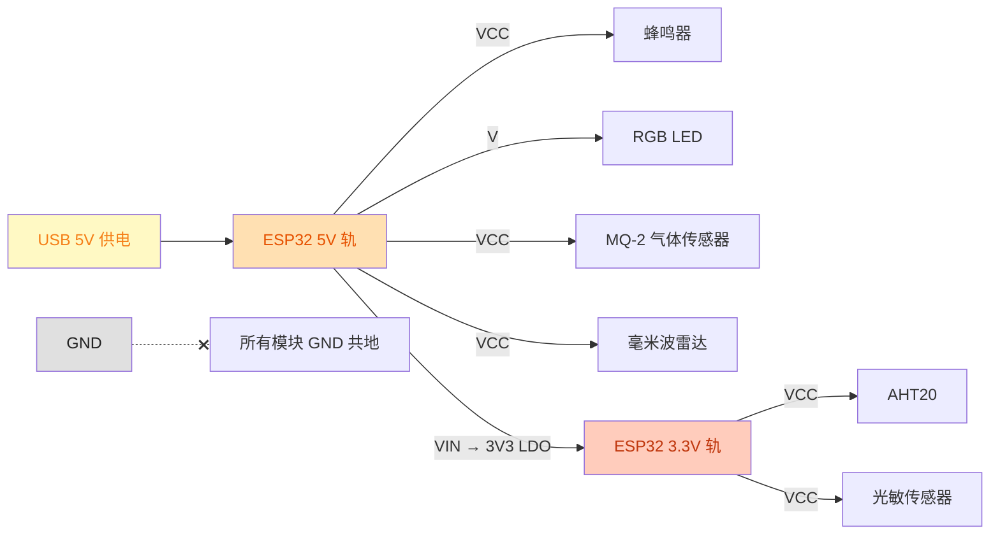
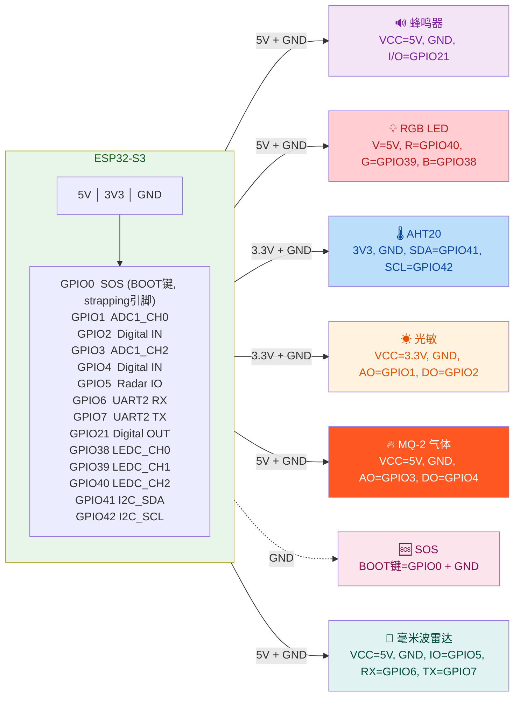

# 银发智慧居家物联网网关 — 硬件连接检查清单

---

## 接线总览流程图

### 全局接线拓扑

### 供电连接拓扑

### 逐模块引脚级连接

---

## 一、供电检查

| # | 检查项 | 标准 | ✔ |
|---|--------|------|---|
| 1.1 | ESP32-S3 供电 | USB 数据线连接电脑或 5V 电源适配器 | □ |
| 1.2 | ESP32-S3 电源指示灯 | 上电后板载 LED 亮起 | □ |
| 1.3 | 各模块供电电压确认 | 见下方表格 | □ |

| 模块 | 工作电压 | ESP32 供电引脚 | ✔ |
|------|----------|---------------|---|
| AHT20 | 3.3V | **3V3** | □ |
| 光敏传感器 | 3.3V | **3V3** | □ |
| MQ-2 气体传感器 | 5V | **5V** | □ |
| RGB LED (V 脚) | 5V | **5V** | □ |
| 蜂鸣器 (VCC) | 5V | **5V** | □ |
| 毫米波雷达 (VCC) | 5V | **5V** | □ |
| SOS 按钮 | — | 板载 BOOT 键 (GPIO0)，不需单独供电 | □ |

> ⚠️ **所有模块的 GND 必须共地**：统一接 ESP32 的 GND 引脚。

---

## 二、模块逐项接线检查

### 2.1 AHT20 温湿度传感器

| 引脚 | → | ESP32-S3 | 已接 ✔ |
|------|---|----------|--------|
| 3V3 (VCC) | → | 3V3 | □ |
| GND | → | GND | □ |
| SDA | → | **GPIO41** | □ |
| SCL | → | **GPIO42** | □ |

> ⚠️ SDA/SCL 不可接反，否则 I2C 无法通信。

---

### 2.2 RGB LED 模块

| 引脚 | → | ESP32-S3 | 已接 ✔ |
|------|---|----------|--------|
| V | → | **5V** | □ |
| R | → | **GPIO40** | □ |
| G | → | **GPIO39** | □ |
| B | → | **GPIO38** | □ |

> ⚠️ **共阳模块注意事项**：  
> - 代码已内置共阳反相（`app_config.h` 中 `RGB_LED_COMMON_ANODE 1`），硬件直接按 R=GPIO40, G=GPIO39, B=GPIO38 接线即可。  
> - R/G/B 引脚串联 **220Ω 限流电阻**，防止烧坏 GPIO。

---

### 2.3 光敏传感器

| 引脚 | → | ESP32-S3 | 已接 ✔ |
|------|---|----------|--------|
| VCC | → | **3V3** | □ |
| GND | → | **GND** | □ |
| AO | → | **GPIO1** (ADC1_CH0) | □ |
| DO | → | **GPIO2** | □ |

> 💡 **调节提示**：  
> - 模块上的蓝色电位器可调节光敏触发阈值。  
> - 顺时针拧 → 更敏感（更亮时触发）。  
> - 逆时针拧 → 更迟钝（更暗时触发）。  
>
> 💡 **光照分级**（代码自动判定）：
> - ADC < 1000：明亮
> - ADC 1000~2000：正常
> - ADC > 2000：较暗（自动开白光，需雷达有人）

---

### 2.4 有源蜂鸣器

| 引脚 | → | ESP32-S3 | 已接 ✔ |
|------|---|----------|--------|
| VCC | → | **5V** | □ |
| GND | → | **GND** | □ |
| I/O | → | **GPIO21** | □ |

> ⚠️ **重要 - 低电平触发**：  
> - 本模块为 **低电平触发**（I/O=0V 时响，I/O=3.3V 时停）。  
> - I/O 脚通常已带三极管驱动，可直接接 ESP32 3.3V GPIO。  
>
> 💡 **告警触发条件**：燃气浓度 >= 中度（等级 2）**或** 温度 > 60℃ **或** SOS → 蜂鸣器响。

---

### 2.5 MQ-2 烟雾/可燃气体传感器

| 引脚 | → | ESP32-S3 | 已接 ✔ |
|------|---|----------|--------|
| VCC | → | **5V** | □ |
| GND | → | **GND** | □ |
| AO | → | **GPIO3** (ADC1_CH2) | □ |
| DO | → | **GPIO4** | □ |

> ⚠️ **预热注意事项**：  
> - MQ-2 传感器需要 **预热 30~60 秒**后才能稳定输出。  
> - 刚上电时 ADC 值可能偏高，预热后恢复正常。  
>
> 💡 **浓度等级参考**（12-bit ADC）：  
> - 0~800：正常  
> - 800~1500：轻度（可能有异味，绿灯）  
> - 1500~2500：中度（建议开窗通风，黄灯+蜂鸣器）  
> - 2500~3500：重度（触发告警，红灯+蜂鸣器）  
> - 3500+：危险（立即处理，红灯+蜂鸣器）

---

### 2.6 SOS 呼救按钮 (BOOT 键)

| 项目 | 连接 | ESP32-S3 引脚 | 说明 |
|------|------|---------------|------|
| SOS 按钮 | 板载 BOOT 键 | **GPIO0** | strapping 引脚，代码不重新配置 |

> 💡 开发板上的 **BOOT 按键** 即 SOS 按钮，内部上拉。  
> 💡 按下时 GPIO0=0（低电平），300ms 消抖，触发/解除 SOS。  
> 💡 SOS 触发：红灯+蜂鸣器 60 秒 + WebSocket 广播 + Web 界面弹窗。  
> 💡 再次按下解除 SOS。

---

### 2.7 毫米波雷达 (24GHz 人体存在/移动检测)

| 引脚 | → | ESP32-S3 | 已接 ✔ |
|------|---|----------|--------|
| VCC | → | **5V** | □ |
| GND | → | **GND** | □ |
| IO | → | **GPIO5** | □ |
| RX | → | **GPIO6** (UART2 RX) | □ |
| TX | → | **GPIO7** (UART2 TX) | □ |

> 💡 **功能说明**：  
> - IO 引脚低电平 = 有人，高电平 = 无人。  
> - 自动模式下，暗 + 有人 → 开灯；亮或无人 → 关灯（人灯联动）。  
> - 手动开灯后，雷达 5 分钟无人 → 自动关灯转 AUTO 模式。  
> - Web 界面实时显示有人/无人状态，带绿点指示。  
>
> 💡 **UART 参数**: 115200bps, 8N1, UART2。

---

## 三、引脚复检汇总表

| GPIO | 方向 | 连接的外设 | 已接 ✔ |
|------|------|-----------|--------|
| GPIO0 | 数字输入 | SOS 按钮 (BOOT键, strapping) | □ |
| GPIO1 | ADC 输入 | 光敏传感器 AO | □ |
| GPIO2 | 数字输入 | 光敏传感器 DO | □ |
| GPIO3 | ADC 输入 | MQ-2 气体传感器 AO | □ |
| GPIO4 | 数字输入 | MQ-2 气体传感器 DO | □ |
| GPIO5 | 数字输入 | 毫米波雷达 IO | □ |
| GPIO6 | UART 输入 | 毫米波雷达 RX | □ |
| GPIO7 | UART 输出 | 毫米波雷达 TX | □ |
| GPIO21 | 数字输出 | 蜂鸣器 I/O | □ |
| GPIO38 | PWM 输出 | RGB LED B | □ |
| GPIO39 | PWM 输出 | RGB LED G | □ |
| GPIO40 | PWM 输出 | RGB LED R | □ |
| GPIO41 | I2C 数据 | AHT20 SDA | □ |
| GPIO42 | I2C 时钟 | AHT20 SCL | □ |

---

## 四、通电前安全检查

| # | 检查项 | ✔ |
|---|--------|---|
| 4.1 | 所有模块 GND 已共地 | □ |
| 4.2 | 3.3V 模块未接 5V（AHT20、光敏） | □ |
| 4.3 | 5V 模块供电正常（蜂鸣器 VCC、RGB V、MQ-2 VCC、雷达 VCC） | □ |
| 4.4 | GPIO 引脚未接错到 5V（ESP32 GPIO 仅耐受 3.3V） | □ |
| 4.5 | RGB LED R/G/B 已串联限流电阻（~220Ω） | □ |
| 4.6 | 雷达 IO/RX/TX 引脚正确（IO→GPIO5, RX→GPIO6, TX→GPIO7） | □ |
| 4.7 | 蜂鸣器 I/O 引脚无短路 | □ |
| 4.8 | 模块接线无裸露焊锡搭接到相邻引脚 | □ |
| 4.9 | 各焊接点/杜邦线接触牢固，无虚接 | □ |

---

## 五、上电功能验证

| # | 验证项 | 预期现象 | 结果 ✔ |
|---|--------|---------|--------|
| 5.1 | ESP32 上电 | 板载 LED 亮起 | □ |
| 5.2 | WiFi 连接 | 串口输出 "WiFi 已连接!" + IP 地址 | □ |
| 5.3 | AHT20 初始化 | 日志 "AHT20 初始化" | □ |
| 5.4 | 光敏传感器初始化 | 日志 "光敏传感器初始化完成" | □ |
| 5.5 | MQ-2 传感器初始化 | 日志 "MQ-2 初始化完成" | □ |
| 5.6 | 毫米波雷达初始化 | 日志 "毫米波雷达初始化完成" | □ |
| 5.7 | HTTP 服务启动 | 日志 "HTTP 服务器启动" | □ |
| 5.8 | WebSocket 启动 | 日志 "WebSocket 服务器启动" | □ |
| 5.9 | Web 页面访问 | 浏览器打开 HTTP://<IP> 正常显示，数据实时刷新 | □ |
| 5.10 | SOS 按钮测试 | 按下 BOOT 键后红灯亮+蜂鸣器响+Web弹窗 | □ |
| 5.11 | 人灯联动测试 | 暗环境+雷达有人→自动开白光；人走→关灯 | □ |
| 5.12 | 手动关灯测试 | Web 点击"开灯"→灯亮；5分钟无人→自动关灯 | □ |

---

## 六、常见问题排查

| 现象 | 可能原因 | 排查方法 |
|------|---------|---------|
| AHT20 读取失败 | I2C 引脚接反或焊接不良 | 检查 SDA/SCL 是否对应 GPIO41/42 |
| 光敏 ADC 始终为 0 | AO 未接或模块未供电 | 万用表测 AO 引脚电压 |
| MQ-2 ADC 始终接近 0 | AO 未接或未预热 | 等待 60 秒后再测，检查 AO 到 GPIO3 连线 |
| MQ-2 DO 始终为 0 | 阈值电位器设置过高 | 逆时针拧电位器降低阈值 |
| 蜂鸣器一直响 | GPIO 默认输出电平错误 | 检查代码中初始电平是否为 High |
| RGB 颜色不对 | 引脚接错或共阳/共阴不匹配 | 确认 R=GPIO40, G=GPIO39, B=GPIO38；共阳已内置反相 |
| SOS 按钮不触发 | GPIO0 strapping 冲突 | 确认固件中未调用 gpio_config 重新配置 GPIO0 |
| 雷达始终显示无人 | IO 引脚接错或供电不足 | 万用表测 GPIO5 电平变化；检查 5V 供电 |
| Web 页面数据不刷新 | WebSocket 断开 | 检查 WiFi 连接；刷新浏览器页面 |
| 烧录失败 | 端口错误或占用 | 关掉串口监视器；检查设备管理器端口号 |

---
